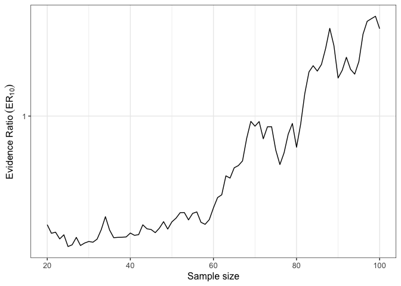
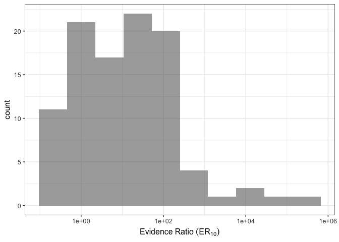
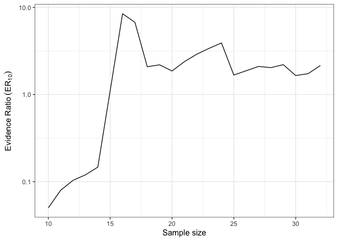
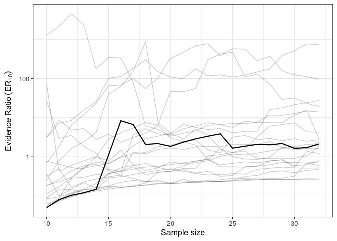

<!-- README.md is generated from README.Rmd. Please edit that file -->
ESTER: Efficient Sequential Testing with Evidence Ratios
========================================================

[](https://cran.r-project.org/package=ESTER) [](https://travis-ci.org/lnalborczyk/ESTER)

`ESTER` offers an implementation of sequential testing that uses evidence ratios computed from the so-called Akaike weights, that are based on either the Akaike Information Criterion (AIC) or the Bayesian Information Criterion (BIC). It allows to do sequential testing on observed data and to study the behaviour of sequential evidence ratios on simulated data as well.

Installation
------------

You can install ESTER from github with:

``` r
if(!require(devtools)){install.packages("devtools")}
devtools::install_github("lnalborczyk/ESTER")
```

Different questions
-------------------

1.  **Simulation**. Given an expected effect size and sample size, what ER evolution should I reasonnably expect ?

2.  **Observed data**. When to stop recruiting participants ?

Simulation
----------

This first function runs a simulated study in which we compare two independant groups, for various effect size and sample size. The `nmin` argument serves to specify from which participant we want to start doing sequential testing (usually we recommand to avoid `nmin` &lt; 20).

``` r
library(ESTER)
ER <- simER(cohensd = 0.6, nmin = 20, n = 100, ic = aic, plot = TRUE)
```



We also can study the distribution of evidence ratios for `nSims` simulations runned with the previous function using `distER`, where the plotted vertical dashed line represents the median of the ERs distribution.

``` r
ER <- distER(cohensd = 0.6, nmin = 20, n = 100, ic = bic, nsims = 100)
```



Observed data
-------------

On the other hand (and perhaps more interestingly), `ESTER` can be used to do sequential testing on your own data. You can study the evolution of sequentials ERs using the `seqER` function.

``` r
data(mtcars)
mod1 <- lm(mpg ~ cyl, mtcars)
mod2 <- lm(mpg ~ cyl + disp, mtcars)
plot(seqER(ic = aic, mod1, mod2, nmin = 10) )
```



In addition, `seqERboot` allows you to study the behavior of sequential ERs computed on your own data, along with sequential ERs computed on bootstrapped samples from your data.

``` r
data(mtcars)
mod1 <- lm(mpg ~ cyl, mtcars)
mod2 <- lm(mpg ~ cyl + disp, mtcars)
plot(seqERboot(ic = bic, mod1, mod2, nmin = 10, order_nb = 20, replace = TRUE) )
```


